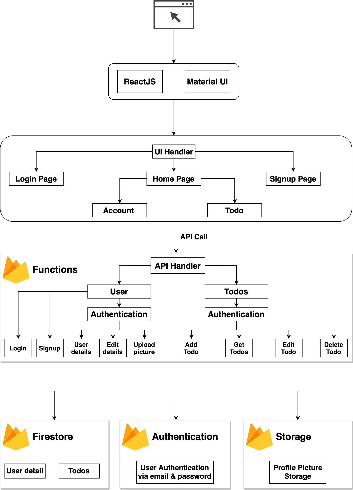
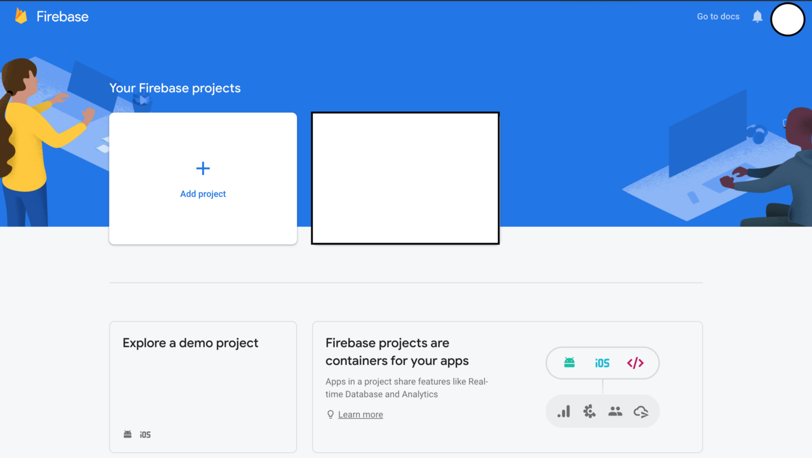
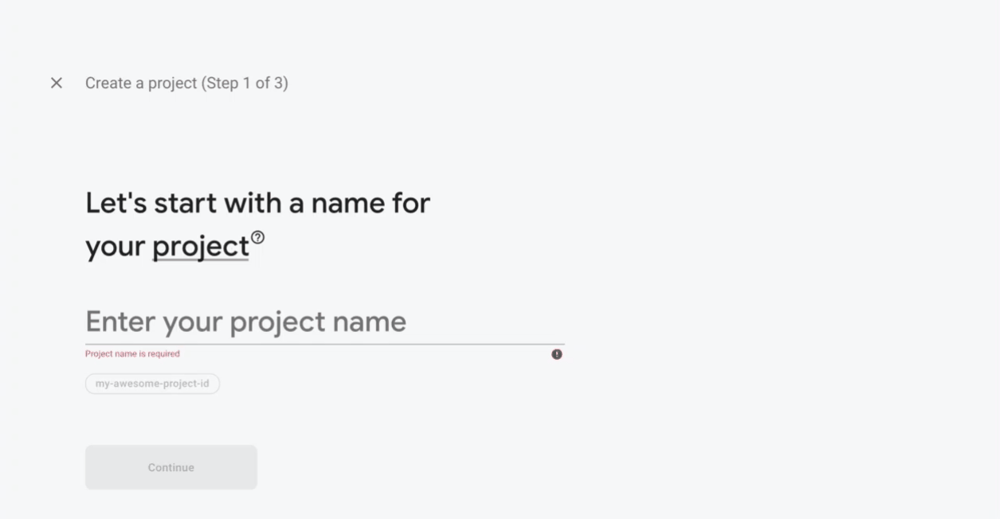
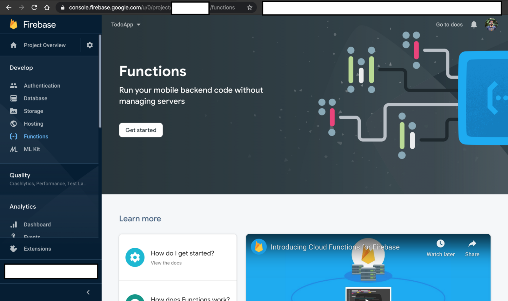

# How to Build a web app using ReactJS and Firebase

We will use the following components in this application:

- ReactJS
- Material UI
- Firebase
- ExpressJS
- Postman

## How our application is going to look:


## Application Architecture:



## Understanding our components:

You may be wondering why we are using firebase in this application. Well, it provides secure Authentication, a Real-time database, a Serverless Component, and a Storage bucket.

We are using Express here so that we don't need to handle HTTP Exceptions. We are going to use all the firebase packages in our functions component. This is because we don't want to make our client application too big, which tends to slow the loading process of the UI.

Note: I am going to divide this tutorial into four separate sections. At the start of every section, you will find a git commit that has the code developed in that section. Also If you want to see the complete code then it is available in this repository.

## Section 1: Developing Todo APIs
In this section, we are going to develop these elements:

Configure the firebase functions.
Install the Express framework and build Todo APIs.
Configuring firestore as database.
The Todo API code implemented in this section can be found at this commit.

Configure Firebase Functions:
Go to the Firebase console.



Select the Add Project option. After that follow the gif down below step by step to configure the firebase project.



Go to the functions tab and click on the Get Started button:



You will see a dialogue box which has instructions on How to set up the Firebase Functions. Go to your local environment. Open a command-line tool. To install the firebase tools in your machine use the command below:

```
curl -sL https://firebase.tools | bash
```

Once that is done then use the command <code>firebase init</code> to configure the firebase functions in your local environment. Select the following options when initialising the firebase function in the local environment:

Which Firebase CLI features do you want to set up for this folder? Press Space to select features, then Enter to confirm your choices => Functions: Configure and deploy Cloud Functions
First, let’s associate this project directory with a Firebase project …. => Use an existing project
Select a default Firebase project for this directory => application_name
What language would you like to use to write Cloud Functions? => JavaScript
Do you want to use ESLint to catch probable bugs and enforce style? => N
Do you want to install dependencies with npm now? (Y/n) => Y
After the configuration is done you will get the following message:

```
✔ Firebase initialization complete!
```

This will be our directory structure once the initialization is completed:

```
+-- firebase.json
+-- functions
|   +-- index.js
|   +-- node_modules
|   +-- package-lock.json
|   +-- package.json
```

Now open the <code>index.js</code> under functions directory and copy-paste the following code:

```
const functions = require('firebase-functions');

exports.helloWorld = functions.https.onRequest((request, response) => {
     response.send("Hello from Firebase!");
});
```

Deploy the code to firebase functions using the following command:

```
firebase deploy
```

Once the deployment is done you will get the following logline at the end of your command line:

```
> ✔  Deploy complete!
> Project Console: https://console.firebase.google.com/project/todoapp-<id>/overview
```

Go to the Project Console > Functions and there you will find the URL of the API. The URL will look like this:

```
https://<hosting-region>-todoapp-<id>.cloudfunctions.net/helloWorld
```

Copy this URL and paste it in the browser. You will get the following response:

```
Hello from Firebase!
```

This confirms that our Firebase function has been configured properly.

## Install the Express Framework:
Now let’s install the <code>Express</code> framework in our project using the following command:

```
npm i express
```

Now let's create an APIs directory inside the functions directory. Inside that directory, we will create a file named <code>todos.js</code>. Remove everything from the <code>index.js</code> and then copy-paste the following code:

```
//index.js

const functions = require('firebase-functions');
const app = require('express')();

const {
    getAllTodos
} = require('./APIs/todos')

app.get('/todos', getAllTodos);
exports.api = functions.https.onRequest(app);
```

We have assigned the getAllTodos function to the <code>/todos</code> route. So all the API calls on this route will execute via the getAllTodos function. Now go to the <code>todos.js</code> file under APIs directory and here we will write the getAllTodos function.

```
//todos.js

exports.getAllTodos = (request, response) => {
    todos = [
        {
            'id': '1',
            'title': 'greeting',
            'body': 'Hello world from sharvin shah'
        },
        {
            'id': '2',
            'title': 'greeting2',
            'body': 'Hello2 world2 from sharvin shah'
        }
    ]
    return response.json(todos);
}
```

Here we have declared a sample JSON object. Later we will derive that from the Firestore. But for the time being we will return this. Now deploy this to your firebase function using the command <code>firebase deploy</code>. It will ask for permission to delete the module <b>helloworld</b> – just enter y.

```
The following functions are found in your project but do not exist in your local source code: helloWorld

Would you like to proceed with deletion? Selecting no will continue the rest of the deployments. (y/N) y
```

Once this is done go to the <b>Project Console > Functions</b> and there you will find the URL of the API. The API will look like this:


```
https://<hosting-region>-todoapp-<id>.cloudfunctions.net/api
```

Now go to the browser and copy-paste the URL and add /todos at the end of this URL. You will get the following output:

```
[
        {
            'id': '1',
            'title': 'greeting',
            'body': 'Hello world from sharvin shah'
        },
        {
            'id': '2',
            'title': 'greeting2',
            'body': 'Hello2 world2 from sharvin shah'
        }
]
```


